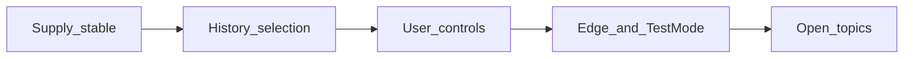

# Study Spark roadmap

Living product roadmap. Coding and other topic-specific examples in conversation are **illustrations only**—the product aims to help almost anyone learn almost anything.

## Interpretation rule (standing)

When discussing features, concepts, or UX using coding examples (or any other single subject), treat them as illustrations only. Design and roadmap language stay **domain-agnostic**. Prefer general terms (topic, concept, skill boundary, prior knowledge) over subject-locked ones in specs and UI copy, unless a feature is explicitly domain-specific (e.g. PC code verifier).

## North-star values

1. **Universal learning tool** — For any learner and any subject; early coding seeds are a bootstrap, not the end state.
2. **Edge of knowledge** — Questions sit just beyond what the learner can do: stretch, not frustration.
3. **User agency** — Learners control difficulty, complexity, and which concepts inside a topic are in or out of scope (e.g. “I’ve covered X, not Y yet”).
4. **Any subject (phased)** — Open learning categories via user-defined topics, only after a solid generation/selection/verification plan.
5. **Never stall, never bore** — Healthy quiz bank + history-aware selection so sessions don’t empty out or loop the same items.

The study agent, memory files, and courses support these values; they are not the primary quiz intelligence loop.

## Current foundation (as of ~0.3.1)

Already shipping (as of ~0.3.1):

- Seed + AI knowledge quizzes, recycle, rate-limit-aware top-up, hourly prefetch toward ~40 ready
- Selection prefers unseen items; cooldown after answers (longer after correct, shorter after miss/skip); recycle only when no new AI landed
- Per-topic skill level / accuracy; attempt outcomes (correct / incorrect / unknown / unfamiliar / retired); mistakes; agent preferences
- Per-topic Gentle / Standard / Stretch plus a comma-separated avoid-list; planner and pick path honor them
- Quiz actions: Not familiar with this (retire + avoid tags + one-step easier, no answer reveal); Don’t ask this again (retire this item); I don’t know (reveal explanation, no skill penalty)
- Room entities that anticipate more intelligence but are lightly used today: `concept_mastery`, concept tags on quiz items

Gaps vs the north star:

- Cooldown is a simple “N quizzes later” rule, not full spaced repetition
- Topics are still a fixed list (enable + difficulty + avoid notes); no user-defined topics yet
- No “Test my knowledge” mode; concept include-lists / mastery UI not built
- `concept_mastery` is not fully wired

## Phased roadmap

### Phase A — Selection memory (next incremental intelligence)

**Goal:** Stop boring repeats; start using history.

- Cooldown after any attempt (don’t recycle the same item for N quizzes / time window)
- Prefer never-seen / low-seen items when the bank is healthy
- Incorrect / unknown: shorter cooldown (light spaced retry); correct: longer cooldown or soft retire
- Surface a short reason chip occasionally (“reviewing a miss” / “new concept”) so the system feels intentional

Primary touchpoints: quiz pick path, attempt history, recycle rules.

### Phase B — Learner controls (difficulty, complexity, concept scope)

**Goal:** Accommodation like “I’m learning concept A in this topic, not concept B yet” (any field).

- Per-topic (later per custom topic) controls:
  - Difficulty / complexity preference (gentle ↔ stretch)
  - Concept include / exclude / “not yet” lists (manual tags + agent-captured phrases)
- Wire controls into quiz planner prompts and local filtering of ready items — must not assume a coding domain
- Start using / updating `concept_mastery` from attempts and tags
- Settings or topic detail UI; agent can propose “I’ll stay within your stated scope until you expand it” and persist as preferences

### Phase B2 — In-quiz coach line (narrow scope)

**Goal:** Let the learner steer the current question without turning Quiz into a full chat screen.

- Compact single-line field (or “Ask coach…” expand) **below** answer actions / on the reveal step—never competing with the prompt as the primary focus
- Prefer a few **quick actions** plus optional free text, so common intents stay one tap:
  - Not familiar with this (soft unknown + mark concept “not yet” / easier next)
  - Don’t ask this again (retire or long-cooldown this item)
  - Explain this (short coach reply on-reveal or expandable; then continue with Next)
- Free-text routes through a **constrained** handler (intent → preference / concept scope / one short explanation)—not an open agent thread in the quiz UI
- Keep progression intact: one coach reply max per question; no chat history on the quiz screen (full Agent tab remains for longer conversations)
- Domain-agnostic copy and intents

Fits after or alongside Phase B; **0.3.1 ships the two quick actions** (not familiar / don’t ask again). Free-text coach line and “Explain this” stay later — I don’t know already shows the stored explanation.

### Phase C — Edge targeting + “Test my knowledge”

**Goal:** Core adaptive loop and an explicit probe mode.

- **Default quiz:** bias toward items near current skill band and weak concepts (edge zone); avoid both trivial and far-above-level when alternatives exist
- Calibrate from recent rolling accuracy (if too easy → nudge harder; if failing → ease)
- **Test my knowledge:** session mode that prioritizes prior shaky / due concepts, denser review, clearer end summary (strengths / gaps)
- Optional session length (e.g. 10 questions) and a simple post-session skill snapshot

Depends on Phase A–B data quality (history + concept scope).

### Phase D — Open-ended learning topics (after a solid design pass)

**Goal:** Almost any learning category via user-defined topics—not a fixed subject enum.

Prerequisites:

- User-defined topics (title + focus notes + level), not comma-bags as the primary key
- Domain-agnostic generation contract; domain-specific sandbox only when needed
- Quality gates + honest framing for high-stakes domains
- Reliable supply and selection that still work when topics are arbitrary

Ship only after a dedicated design/implementation plan for this phase—not as a quick Settings hack.

### Phase E — Platform / quality (parallel tracks, not blockers)

- Domain-specific verifiers only where needed (e.g. PC `verify-service/` for executable code quizzes)—not required for general knowledge topics
- Stronger courses/modules UX; provider sync fields already reserved
- Quiet-hours UI polish; notification/prefetch tuning
- Multi-provider volume for long sessions (Gemini primary, Groq failover already exist)

## Ideas to discuss (not committed)

Subject-agnostic unless noted:

1. **Learning boundary card** — Per topic: “Know / Learning / Not yet” concept chips; quizzes must respect it
2. **Frustration brake** — After repeated misses on a concept, auto-ease difficulty or offer a gentler explanation path
3. **Explain then quiz** — Short micro-lesson when entering a new concept, then a check question
4. **Session intents** — Warm-up, Push me, Review mistakes—same engine, different sampling weights
5. **Evidence of growth** — Progress that shows concepts moving shaky → solid, not only topic-level floats
6. **Offline-first study packs** — Larger prefetch on Wi‑Fi / charging so edge targeting never starves mid-session
7. **In-quiz coach line** — See Phase B2: quick actions + optional one-line text without hijacking quiz flow

When proposing new ideas: generalize topic-specific examples before designing.
